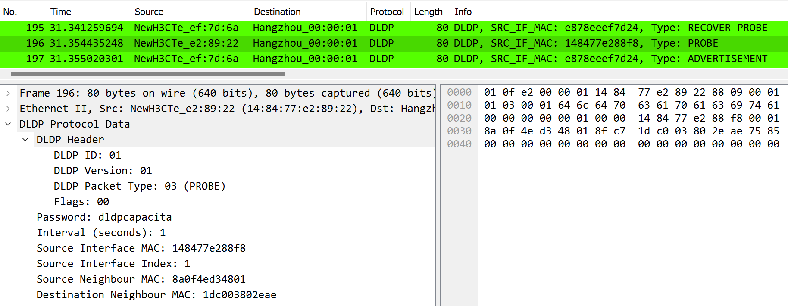

# Device Link Detection Protocol

This section contains a lua dissector file designed to analyze and interpret Device Link Detection Protocol (DLDP) packets in Wireshark. DLDP is a protocol used in network switches to detect interface problems on interface links that be inoperate with unidirecional problems, link transceivers that use 2-simplex-channels for communication an one of this channels be inoperate. DLDP is used to monitorate this channels.  



---
### Prerequisites

- Version 4.0.6-gac2f5a01286a of Wireshak or above.
- Git (for cloning the repository).

---
### Documentation

This dissector interpretes DLDP Packets compatible with the following devices: 

- S5520 Series (Intelbras's) 
- S5525 Series (Intelbras's) 
- S5530 Series (Intelbras's) 

#### The LD packet have the structure below (example):

```
01 0f e2 00 00 01 e8 78 ee ef 7d 6a 88 09 00 01
01 01 00 01 64 6c 64 70 63 61 70 61 63 69 74 61
00 00 00 00 00 01 00 00 e8 78 ee ef 7d 24 00 02
```

#### Witch the following fields are located: 

- Ethernet Frame Header Field: 
```
01 0f e2 00 00 01 e8 78 ee ef 7d 6a 
```
Description: The Ethernet Frame Header Field consists of 6 bytes for the destination MAC address `01 0f e2 00 00 01`, 6 bytes for the source MAC address `e8 78 ee ef 7d 6a `, and 2 bytes for the Ethernet type `88 09` (for slow protocols).

- Ethernet Slow-Protocols subtype Field: 
--- 
```
00r
```

Description: This field is used for DLDP segmentation on slow-protocols ethernet type.

--- 
- Configuration Flags: 
```
01 01 00 01
```
Description: underchecking

---
- DLDP Password: 
```
64 6c 64 70 63 61 70 61 63 69 74 61
```
Description: String used to send DLDP password for the peer switch. 

Note: This field has a dynamic lenght and can not be displayed if the DLDP auth type is not setted to simple-password. 

---
- DLDP Interval: 
```
00 01
```
Description: DLDP interval of interface check, in seconds.  

---
- Source Interface MAC Address: 
```
e8 78 ee ef 7d 24
```
Description: DLDP source Interface MAC Address.   

---
- DLDP Sequence Number: 
```
00 02
```
Description: DLDP sequence number check. 

---


