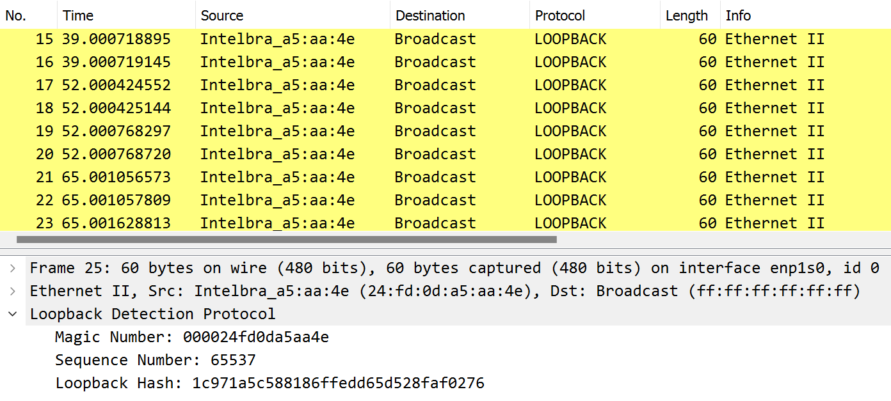

# Loopback Detection Dissector for Wireshark

This section contains a lua dissector file designed to analyze and interpret Loopback Detection (LBD) packets in Wireshark. Loopback Detection is a protocol used in network switches to detect and prevent loops in the network topology.



---
### Prerequisites

- Version 4.0.6-gac2f5a01286a of Wireshak or above.
- Git (for cloning the repository).

---
### Documentation

This dissector interpretes LoopbackDetection Packets compatible with the following devices: 

- SG 1002 MR L2+ (Intelbras's) 
- SF 2622 MR L2+ (Intelbras's) 

#### The LD packet have the structure below (example):

```
ff ff ff ff ff ff 24 fd 0d a5 aa 4e 99 00 00 00
24 fd 0d a5 aa 4e 00 01 00 01 1c 97 1a 5c 58 81
86 ff ed d6 5d 52 8f af 02 76 00 00 00 00 00 00
00 00 00 00 00 00 00 00 00 00 00 00
```

#### Witch the following fields are located: 

- Ethernet Frame Header Field: 
```
ff ff ff ff ff ff 24 fd 0d a5 aa 4e 99 00
```
Description: The Ethernet Frame Header Field consists of 6 bytes for the destination MAC address `ff ff ff ff ff ff`, 6 bytes for the source MAC address `24 fd 0d a5 aa 4e`, and 2 bytes for the Ethernet type `99 00`.

--- 
- Magic Number LoopbackDetection Field: 
```
00 24 fd 0d a5 aa 4e
```
Description: The Magic Number LoopbackDetection Field is a 6-byte field used in Loopback Detection packets to identify the protocol. In this case is set to `00 24 fd 0d a5 aa 4e`.


---
- Sequence Number LoopbackDetection Field: 
```
00 01 00 01
```
Description: The Sequence Number LoopbackDetection Field is a 4-byte field used in Loopback Detection packets to indicate the sequence number of the packet.

---
- LoopbackDetection Hash: 
```
1c 97 1a 5c 58 81 86 ff ed d6 5d 52 8f af 02 76
```
Description: The LoopbackDetection Hash is a 16-byte field used in Loopback Detection packets to verify the integrity of the packet. It is calculated based on the contents of the packet.

---


